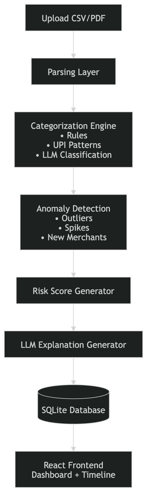
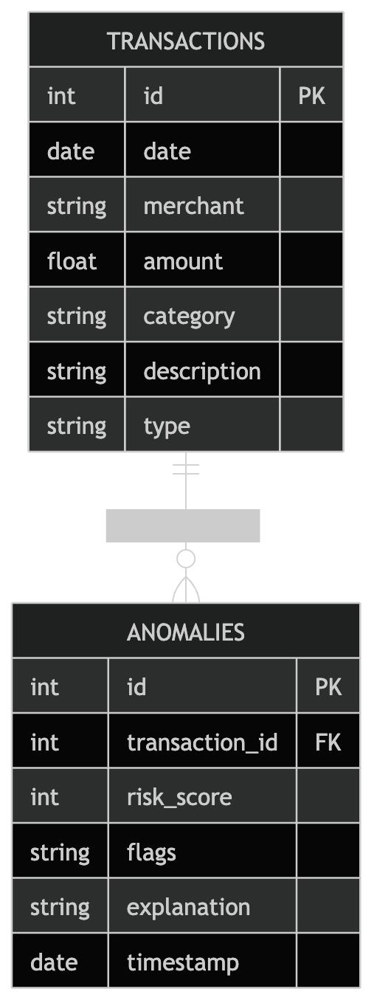

# **Where Is My Money?**
> A personal finance anomaly detector that helps you understand where your money actually goes.

A smart, AI-powered financial insight system that analyzes your bank statements, auto-categorizes spending, detects anomalies, and explains suspicious transactions.

---

# **1. Problem Statement**

### **Problem Title**
Lack of Intelligent Insights in Personal Finance Tracking

### **Problem Description**
Bank statements only provide raw data, leaving users unaware of unusual charges, hidden overspending, or suspicious merchants. Users generally realize financial issues *after* money is lost.

### **Target Users**
- Students  
- Working professionals  
- Multi-account users  
- Anyone tracking personal finances  

### **Existing Gaps**
- No automated anomaly detection  
- No categorization of merchants  
- No LLM-powered insights  
- No visual breakdowns of anomalies  
- No behavioral financial analysis  

---

# **2. Problem Understanding & Approach**

### **Root Cause Analysis**
- Statements lack intelligence  
- Manual spending review is time-consuming  
- Users cannot detect behavioral shifts or sudden financial spikes  

### **Solution Strategy**
- Automate categorization using rules + AI  
- Detect anomalies through pattern analysis  
- Explain anomalies using an LLM  
- Provide an interactive visualization dashboard  

---

# **3. Proposed Solution**

### **Solution Overview**
Where Is My Money? converts raw bank statement data into actionable financial intelligence.

### **Core Idea**
Upload → Parse → Categorize → Detect Anomalies → Explain → Visualize

### **Key Features**
- Upload CSV/PDF statements  
- Rule-based + LLM-based categorization  
- Detect spikes, outliers, new merchants  
- Generate risk scores  
- AI explanations for anomalies  
- Timeline visualization  
- Clean React dashboard  

---

# **4. System Architecture**

### **High-Level Flow**
User → Frontend → Backend → ML/LLM → Database → Insights Response

### **Architecture Description**
1. User uploads CSV/PDF  
2. Backend parses data  
3. Categorization engine assigns categories  
4. Anomaly engine finds unusual records  
5. LLM produces explanations & risk scores  
6. UI visualizes everything  

### **Architecture Diagram**

# **5. Database Design**

### **ER Diagram**

### **ER Diagram Description**
- **Users**: stores identity  
- **Transactions**: stores parsed bank entries  
- **Categories**: maps merchants/spends  
- **Anomalies**: stores detected anomalies  
- **RiskScores**: risk level + LLM explanation  

---

# **6. Dataset Selected**

This project does not require a pre-built dataset.
Instead, the system processes user-uploaded bank statements, including:
 - CSV statements
 - PDF statements

---

# **7. Model Selected**

### **Model Name**
- OpenAI GPT / Gemini Model  
- Rule-based Categorization Model  

### **Selection Reasoning**
- Strong natural language understanding  
- Works well for unfamiliar merchants  
- Excellent at generating explanations  

---

# **8. Technology Stack**

### **Frontend**
- React + Vite  
- CSS Modules  
- Recharts  
- Axios  

### **Backend**
- Node.js  
- Express.js  
- csv-parser  
- pdf-parse  

### **ML/AI**
- OpenAI API / Gemini API  

### **Database**
- SQLite  

### **Deployment**
- Render / Vercel / Railway (not decided yet)

---

# **9. API Documentation & Testing**

### **API Endpoints List**

#### **1. POST /upload**
Upload CSV/PDF → parse + store  
#### **2. GET /transactions**
Fetch all parsed transactions  
#### **3. GET /anomalies**
Fetch anomaly results  
#### **4. POST /explain**
Generate LLM explanation for a transaction  

---

### **API Testing Screenshots**
will add

---

# **10. Module-wise Development & Deliverables**

### **Checkpoint 1: **
**Deliverables:**
- Problem statement  
- Architecture plan  

### **Checkpoint 2: **
**Deliverables:**

### **Checkpoint 3: **
**Deliverables:**

### **Checkpoint 4: **
**Deliverables:**
 

### **Checkpoint 5: **
**Deliverables:**

### **Checkpoint 6: **
**Deliverables:**

---

# **11. End-to-End Workflow**

Upload → Parse → Categorize → Detect → Score → Explain → Visualize → Insights to User

---

# **12. Demo & Video**

**Deployed Link:** [_Add Link_ ](https://where-is-my-money-1.onrender.com/) 
**Demo Video and PPT Link:** [_Add Link_ ](https://drive.google.com/drive/folders/1rIzOwSGxG-bTAPu3QDL_RIzspowdFYO3)

---

# **13. Hackathon Deliverables Summary**
- Working prototype  
- End-to-end pipeline  
- AI-backed anomaly detection  
- Clean UI  
- Architecture + ER diagrams  
- Demo video  

---

# **14. Team Roles & Responsibilities**

| Member Name | Role | Responsibilities |
|------------|------|------------------|
| Ipshita Patel| Frontend + PPT + Docs | Dashboard, UI ,Coordination & documentation |
| Kumar Manak| Backend  | Parsing, API, DB  |
| Krish Mukesh Jain | Backend + ML/AI | Categorization + LLM |

---

# **15. Future Scope & Scalability**

### **Short-Term**
- Multi-bank support  
- Exportable PDF reports  
- More graphs  

### **Long-Term**
- Real-time anomaly alerts  
- Investment anomaly detection  
- Integration with UPI apps  

---

# **16. Known Limitations**
- Accuracy depends on transaction quality  
- Requires stable parsing for PDFs   

---

# **17. Impact**
Where Is My Money? empowers users with clear, intelligent financial awareness—helping people detect problems earlier, avoid unnecessary losses, and understand spending behavior with AI-driven insights.

---
